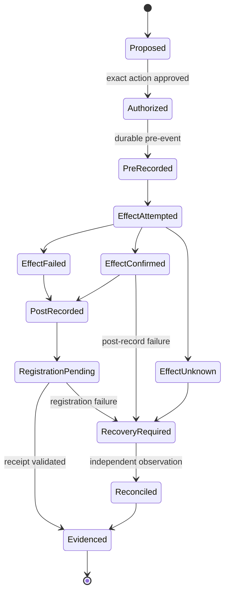

# Failure and reconciliation

Status: **Draft, non-normative Phase 0 architecture**

## Central problem

An external side effect and its audit record usually cannot share one atomic
transaction. The system must therefore expose, contain, and reconcile partial
success rather than report a false all-or-nothing result.

## Failure matrix

| Pre-event | Effect | Post-event | Registration | Required state |
| --- | --- | --- | --- | --- |
| Failed | Not attempted | Not applicable | Not applicable | Denied or failed closed |
| Durable | Failed | Durable | Successful | Evidenced failure |
| Durable | Succeeded | Durable | Successful | Evidenced success |
| Durable | Succeeded | Failed | Unknown | Recovery required; do not claim fully evidenced success |
| Durable | Unknown | Durable | Successful | Recovery required until external effect resolved |
| Durable | Succeeded | Durable | Failed | Registration failure; containment/retry/reconciliation policy |
| Durable | Duplicate retry | Durable | Successful | At most one effect; deterministic replay |
| Durable | Conflicting retry | Not attempted | Successful denial event | Fail closed conflict |

## Required identifiers

The operation, submission, approval, authority grant, exact-action digest,
pre-event, executor attempt, external idempotency key, external result, post-
event, signed statement, and transparency receipt must be linkable without
assuming they are the same object.

## Reconciliation procedure

1. Freeze or contain further effects within the affected scope.
2. Preserve all partial records and error output.
3. Query the external system using an independently meaningful correlation or
   idempotency identifier.
4. Classify the effect as confirmed, absent, partial, reversed, or unknown.
5. Record who observed it, their relationship to the executor, and evidence.
6. Add a new event; never rewrite the failed or ambiguous event.
7. Register the superseding/reconciliation statement when Level T/A applies.
8. Require a new Human Supervisor decision before retry, compensation, or
   normal operation when policy requires it.

## Retry rules

- Identical submission ID and canonical content must replay deterministically.
- Different content under the same identifier must fail closed.
- Retry must recheck expiration, revocation, policy version, and scope.
- An external idempotency guarantee must be documented, not assumed.
- Compensation is a new authorized action, not an invisible rollback.
- Timeout is an unknown outcome unless authoritative evidence proves otherwise.

## Recovery boundary

After restore, independently held checkpoints and transparency evidence must be
compared with restored state before normal Level A operation resumes. Missing
local events, extra unregistered events, inconsistent policies, or unknown key
history require reconciliation and an attributable disposition.
