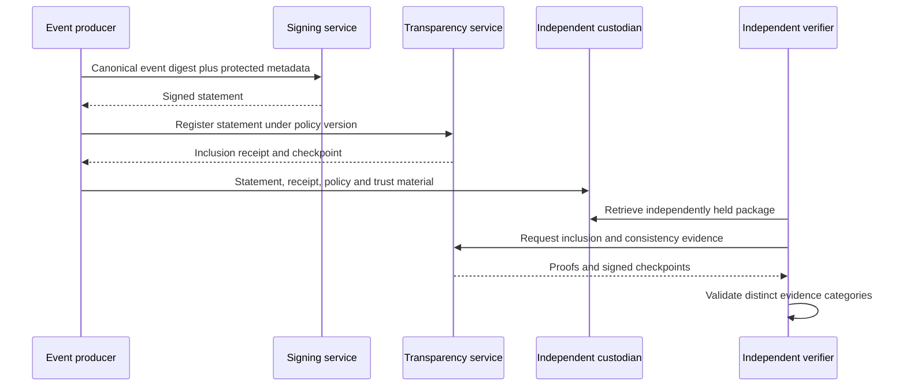

# Transparency interface

Status: **Draft, non-normative interoperability outline**

## Purpose

Define the minimum conceptual interface between a HAIO-GATS event producer and
an independently operated transparency service. This is not an API standard or
selected receipt profile.

## Registration request

A registration request should bind:

- statement and statement type;
- issuer identity and signing key identifier;
- canonicalization and digest algorithms;
- subject and operation identifier;
- requested registration policy and version;
- confidentiality or disclosure class;
- client submission identifier; and
- required collateral references.

## Registration response

The service should return an attributable result containing:

- accepted or rejected status and reason;
- statement identifier;
- applied registration policy and version;
- service identity and key identifier;
- verifiable-data-structure profile;
- inclusion receipt or proof;
- signed checkpoint;
- registration timestamp and clock semantics;
- consistency-proof retrieval information; and
- required monitor or gossip information.

## Verification outputs

An interface must never collapse the following into a single `verified` flag:

| Category | Question |
| --- | --- |
| Statement signature | Do the protected bytes validate under the indicated key? |
| Issuer authentication | Is the key bound to the claimed issuer? |
| Policy acceptance | Did the service accept under the stated policy? |
| Inclusion | Is the statement committed by the checkpoint? |
| Consistency | Does this checkpoint append to a previously observed history? |
| Non-equivocation | Do independent observers see compatible histories? |
| Checkpoint custody | Was evidence retained outside the source trust domain? |
| Actor authority | Was the actor authorized for this exact operation? |
| Statement accuracy | Does primary evidence support the statement? |
| Independent verification | Did a sufficiently independent verifier assess it? |

## Failure behavior

- Invalid issuer, signature, policy, or collateral must fail closed.
- Duplicate identical registration should be deterministic.
- Conflicting reuse of a submission identifier must be attributable and fail
  closed.
- Timeout must not be reported as rejection or acceptance without evidence.
- Action success followed by registration failure must enter a visible recovery
  state governed by RC-02 and T-10.
- Key rotation and compromise must preserve historical interpretation.

## Profiles requiring selection

- Signed-statement representation and protected metadata.
- Canonicalization profile, potentially RFC 8785 for JSON.
- Receipt profile, potentially RFC 9942.
- Verifiable data structure, monitor, and consistency protocol.
- Private-event commitment and disclosure mechanism.
- Witness or second-service arrangement.
- Trusted time and clock-quality semantics.
- Export, retention, and independent retrieval format.

No profile is selected by this draft.
