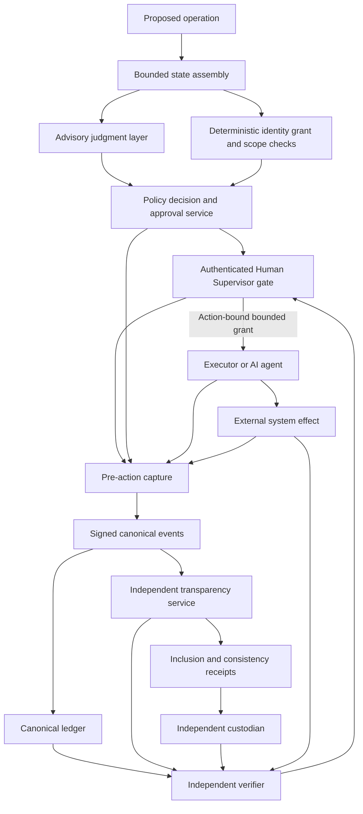

# Trust domains and authority flow

Status: **Draft, non-normative Phase 0 architecture**

## Governing principle

No component may infer authority from model confidence, a tool request, a
signature without policy context, or an earlier lifecycle approval. The Human
Supervisor remains the accountable natural person; deterministic systems bind
and enforce the resulting decision.

## Domain responsibilities

| Domain | Establishes | Does not establish by itself |
| --- | --- | --- |
| Identity provider | Authentication evidence for a subject | Operational authority or statement truth |
| Authority service | Current grant and revocation state | Human understanding or external outcome |
| Advisory judgment | Typed recommendation, score, uncertainty | Identity, authority, permission, or proof |
| Policy decision point | Deterministic decision under declared policy | Human approval when required |
| Human Supervisor | Accountable decision within authenticated authority | That execution or recording succeeded |
| Executor | Attempted or completed action | Independent verification of its own result |
| Canonical recorder | Durable ordered event under its failure contract | Independent custody or non-equivocation |
| Signing service | Authentic signature under a key | Authority, accuracy, completeness, or custody |
| Transparency service | Policy acceptance, inclusion, consistency evidence | Semantic truth or external effect |
| Custodian | Independently retained evidence | Correct interpretation without verification |
| Verifier | Evaluation against criteria and primary evidence | Independence unless relationship supports it |

## Independence test

For a role to support an independence claim, document:

- separate controlling organization or enforceable administrative boundary;
- separate credentials and key custody;
- inability of the executor/recorder administrator to rewrite retained evidence;
- independently accessible retrieval and verification procedures;
- outage, compromise, and succession arrangements; and
- disclosed financial, employment, and infrastructure dependencies.

Different software processes under the same administrator are not automatically
independent. A public Git repository is a collaboration and distribution
surface, not by itself an independent operational custodian.

## TypeSafe/Jev placement

If TypeSafe/Jev is integrated, it belongs only in the advisory judgment layer.
Its typed questions, candidates, scores, confidence, model/version, bounded
input digest, policy disposition, and Human Supervisor response may be recorded.
Its result cannot authenticate an actor, grant authority, validate a signature,
issue a receipt, execute an action, or independently verify an outcome.
